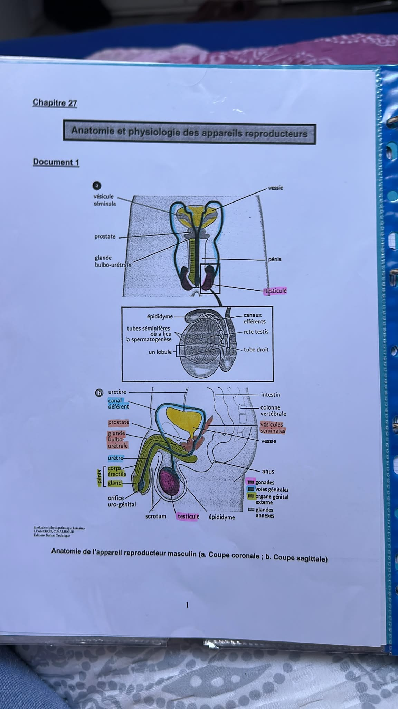
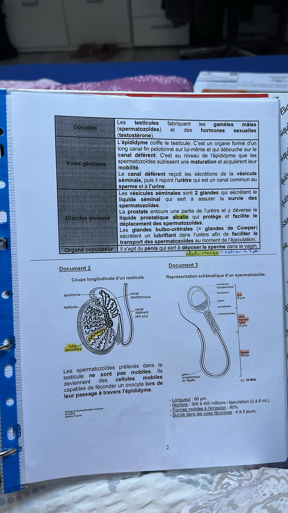
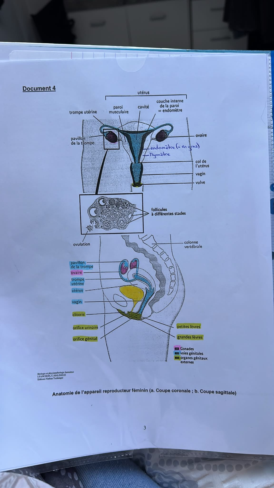
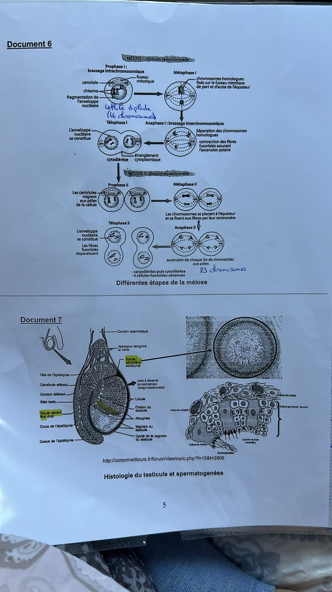
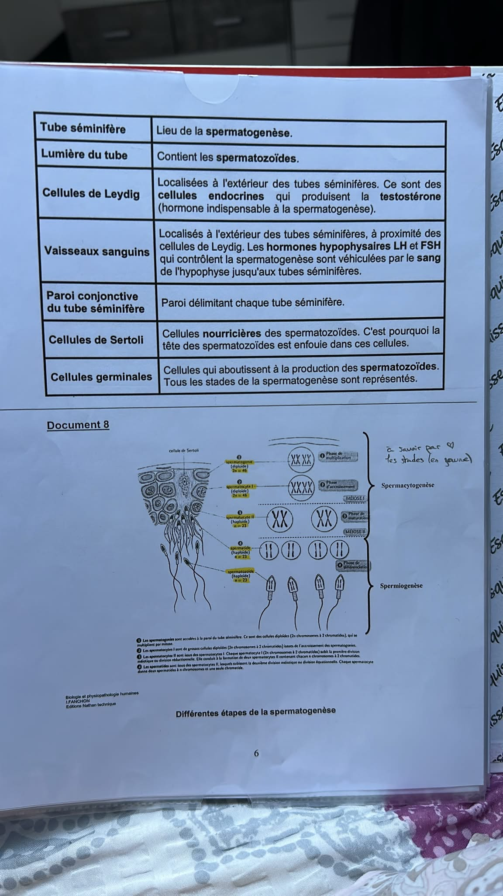
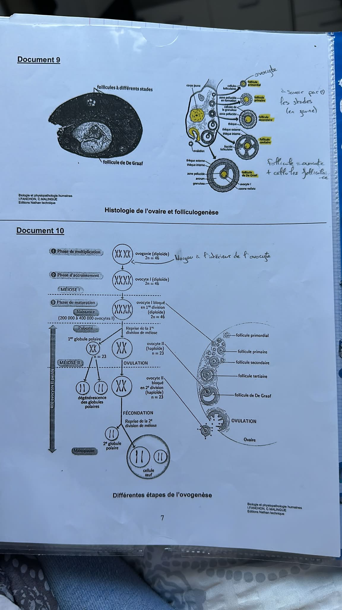

# Chapitre 27 — Anatomie et physiologie des appareils reproducteurs

> **Notions importantes — version complète**

-----

## 1. Introduction

La reproduction est une caractéristique fondamentale des êtres vivants. Chez l’homme, elle est **sexuée et biparentale** (nécessite un homme et une femme). Chaque individu doit produire des **gamètes** : spermatozoïdes chez l’homme, ovocytes chez la femme.

### Étymologies utiles

|Racine                   |Signification                                                        |
|-------------------------|---------------------------------------------------------------------|
|**Physi(o)** / **-logie**|fonctionnement / étude de → **Physiologie** = étude du fonctionnement|
|**Orch(i) / orchid(o)**  |testicule                                                            |
|**Prostat(o)**           |prostate                                                             |
|**Sperm(o) / Spermat(o)**|sperme                                                               |
|**Cervic(o)**            |col de l’utérus                                                      |
|**Colp(o) / vagin(o)**   |vagin                                                                |
|**Hyster(o) / métr(o)**  |utérus                                                               |
|**Mamm(o) / mast(o)**    |glande mammaire                                                      |
|**Ovari(o)** / **Ov(o)** |ovaire / œuf                                                         |
|**Salping(o)**           |trompe                                                               |
|**Méno(s)**              |mois → **Ménopause** = arrêt définitif des règles                    |
|**Alcalin**              |basique = pH supérieur à 7                                           |

-----

## 2. Anatomie de l’appareil génital masculin

L’appareil génital masculin est formé de **gonades**, **voies génitales**, **glandes annexes** et d’un **organe copulateur**.

### Gonades (testicules)

Fabriquent les **gamètes mâles** (spermatozoïdes) et les **hormones sexuelles** (testostérone).

### Voies génitales

- **Épididyme** : organe formé d’un long canal fin pelotonné sur lui-même qui coiffe le testicule. C’est au niveau de l’épididyme que les spermatozoïdes subissent une **maturation** et acquièrent leur **mobilité**.
- **Canal déférent** : reçoit les sécrétions de la vésicule séminale, puis rejoint l’**urètre** (canal commun au sperme et à l’urine).

### Glandes annexes

|Glande                                           |Sécrétion                           |Rôle                                                              |
|-------------------------------------------------|------------------------------------|------------------------------------------------------------------|
|**Vésicules séminales** (×2)                     |Liquide séminal                     |Assure la **survie des spermatozoïdes**                           |
|**Prostate**                                     |Liquide prostatique alcalin (pH > 7)|Protège et **facilite le déplacement** des spermatozoïdes         |
|**Glandes bulbo-urétrales** (= glandes de Cowper)|Lubrifiant                          |**Facilite le transport** des spermatozoïdes lors de l’éjaculation|

### Organe copulateur

**Pénis** : sert à déposer le sperme dans le vagin.

> 📌 **À retenir :** Le **sperme** = spermatozoïdes + liquide séminal + liquide prostatique.

> 📷 *Schéma du prof — Anatomie de l’appareil reproducteur masculin (coupe coronale et sagittale)*
> 
> 

-----

## 3. Le spermatozoïde

### Caractéristiques

|Paramètre                      |Valeur                       |
|-------------------------------|-----------------------------|
|Longueur totale                |60 µm                        |
|Nombre par éjaculation         |300 à 400 millions (2 à 6 mL)|
|Formes mobiles à l’émission    |80 %                         |
|Survie dans les voies féminines|**4 à 5 jours**              |

**Structure :** membrane cytoplasmique, acrosome, noyau, cytoplasme, mitochondries, pièce intermédiaire, flagelle (50 µm).

> ⚠️ Les spermatozoïdes prélevés dans le testicule **ne sont pas mobiles**. Ils deviennent des cellules mobiles capables de féconder un ovocyte lors de leur **passage dans l’épididyme**.

> 📷 *Schéma du prof — Coupe longitudinale du testicule et structure d’un spermatozoïde*
> 
> 

-----

## 4. Anatomie de l’appareil génital féminin

Composé d’organes génitaux **internes** et **externes**.

### Organes génitaux internes

- **Ovaires** (= gonades) : situés de part et d’autre de l’utérus auquel ils sont fixés par des **ligaments** ; produisent les **ovocytes** + **hormones sexuelles féminines** (progestérone et œstrogènes).
- **Trompes de Fallope** (= trompes utérines) : assurent le transport et la rencontre des gamètes ; leur extrémité (le **pavillon**) capte l’ovocyte au moment de l’ovulation.
- **Utérus** : organe creux musculeux de la taille d’une petite poire renversée. Formé de 2 parties : le corps et le **col de l’utérus** qui débouche dans le vagin.
  
  D’un point de vue histologique, formé de l’intérieur vers l’extérieur :
  
  |Couche                        |Rôle                                                                                                                                    |
  |------------------------------|----------------------------------------------------------------------------------------------------------------------------------------|
  |**Endomètre** (couche interne)|Évolue au cours du cycle sexuel. Sans grossesse → éliminé en fin de cycle = **règles / menstruations**                                  |
  |**Myomètre** (couche externe) |Épaisse enveloppe de muscles lisses ; se contracte **au moment de l’accouchement et au début de chaque cycle** pour expulser l’endomètre|

> ⚠️ L’utérus est **l’organe de la gestation** où se développe le fœtus.
- **Vagin** : du col de l’utérus à la vulve ; **organe de l’accouplement** qui reçoit le pénis lors du rapport sexuel.

### Organes génitaux externes

Regroupés au niveau de la **vulve** : grandes lèvres et petites lèvres (qui protègent la région génitale), **clitoris** (petit organe érectile), orifices urinaire et génital.

> 📝 **Remarque :** Les **glandes mammaires** sont des glandes annexes qui interviennent dans la **lactation**.

> 📷 *Schéma du prof — Anatomie de l’appareil reproducteur féminin (coupe coronale et sagittale)*
> 
> 

-----

## 5. Gamétogenèse

**Gamétogenèse** (gamète + genèse = formation) = formation des gamètes.  
**Gamètes** = cellules spécialisées dans la reproduction (spermatozoïdes chez l’homme / ovocytes chez la femme).

### 5.1 Cellules somatiques vs cellules germinales

|                     |Cellules somatiques                                         |Cellules germinales (gamètes)                             |
|---------------------|------------------------------------------------------------|----------------------------------------------------------|
|Nombre de chromosomes|46 (2n = **diploïdes**) → 2 exemplaires de chaque chromosome|23 (n = **haploïdes**) → 1 exemplaire de chaque chromosome|
|Division             |Mitose                                                      |Méiose                                                    |

> 📌 **À retenir :** Si les gamètes avaient 46 chromosomes, la fécondation donnerait 92 chromosomes → impossible. Donc les gamètes doivent être **haploïdes (n = 23)**.

### 5.2 Méiose

**Définition :** Ensemble des étapes permettant, à partir d’une cellule **diploïde (46 chromosomes)**, d’obtenir **4 cellules haploïdes (23 chromosomes)**.

|Division                     |Phase clé |Mécanisme                                                                                               |
|-----------------------------|----------|--------------------------------------------------------------------------------------------------------|
|**Méiose I** (réductionnelle)|Prophase I|**Brassage intrachromosomique** (échanges de fragments entre chromatides = crossing-over)               |
|                             |Anaphase I|**Brassage interchromosomique** (séparation aléatoire des chromosomes homologues) → 2 cellules haploïdes|
|**Méiose II** (équationnelle)|—         |→ 4 cellules haploïdes à **23 chromosomes**                                                             |

> 📷 *Schéma du prof — Différentes étapes de la méiose*
> 
> 

-----

## 6. Spermatogenèse

**Définition :** Ensemble des étapes aboutissant à la production des spermatozoïdes.

- Commence à la **puberté** et dure **74 jours**
- Se fait de façon **continue**, de la paroi du tube séminifère vers la lumière

### Histologie du testicule ⚠️ À connaître

|Structure              |Rôle                                                                                                                    |
|-----------------------|------------------------------------------------------------------------------------------------------------------------|
|**Tube séminifère**    |Lieu de la spermatogenèse                                                                                               |
|**Lumière du tube**    |Contient les spermatozoïdes                                                                                             |
|**Cellules de Leydig** |Cellules endocrines (extérieur des tubes) ; produisent la **testostérone** (indispensable à la spermatogenèse)          |
|**Cellules de Sertoli**|Cellules **nourricières** des spermatozoïdes en développement (la tête des spermatozoïdes est enfouie dans ces cellules)|
|**Cellules germinales**|Cellules qui aboutissent à la production des spermatozoïdes (tous les stades représentés)                               |
|**Vaisseaux sanguins** |Extérieur des tubes, à proximité des cellules de Leydig ; véhiculent les **hormones hypophysaires LH et FSH**           |
|**Paroi conjonctive**  |Délimite chaque tube séminifère                                                                                         |

> 📷 *Schéma du prof — Histologie du testicule*
> 
> 

### Étapes de la spermatogenèse

**Phase 1 — Spermatocytogenèse**

|Cellule        |Ploïdie|Mécanisme                    |
|---------------|-------|-----------------------------|
|Spermatogonie  |2n = 46|Multiplication par **mitose**|
|Spermatocyte I |2n = 46|Phase d’accroissement        |
|Spermatocyte II|n = 23 |**Méiose I**                 |
|Spermatide     |n = 23 |**Méiose II**                |

**Phase 2 — Spermiogenèse**

Spermatide → **Spermatozoïde** (n = 23) = phase de **différenciation**

> 📷 *Schéma du prof — Différentes étapes de la spermatogenèse*
> 
> 

-----

## 7. Ovogenèse

**Définition :** Transformation progressive d’une cellule souche diploïde (oogonie) en cellule haploïde fécondable (ovocyte).

Contrairement à la spermatogenèse :

- L’ovogenèse **n’est pas continue**
- Débute chez l’**embryon**, s’arrête durant l’**enfance**, reprend entre la **puberté** et la **ménopause**

### 7.1 Folliculogenèse ⚠️ À connaître

Un **follicule** = petit sac pluricellulaire arrondi contenant un **ovocyte** et des **cellules folliculaires** qui assurent son développement.

|Stade                              |Description                                                                                                                           |
|-----------------------------------|--------------------------------------------------------------------------------------------------------------------------------------|
|**Follicule primordial**           |Ovocyte I + quelques cellules folliculaires nourricières. À la naissance : 1 à 2 millions ; à la puberté : ~300 000                   |
|**Follicule primaire**             |Dès la puberté, ~20 follicules primordiaux évoluent par cycle. Cellules folliculaires en **une seule couche** autour de l’ovocyte I   |
|**Follicule secondaire**           |Multiplication cellulaire → **granulosa** ; zone pellucide visible ; **thèques interne et externe** se forment                        |
|**Follicule tertiaire (cavitaire)**|Fusion de petits espaces liquidiens → **antrum** (= cavité folliculaire) ; thèques bien différenciées                                 |
|**Follicule mûr (de De Graaf)**    |Antrum agrandi ; ovocyte I entouré de la **corona radiata** ; fin de la 1ère division de méiose → **ovocyte II** + 1er globule polaire|

> 📌 **Ovulation :** Le follicule de De Graaf libère l’ovocyte II au **14ème jour du cycle** (pour un cycle de 28 jours).  
> Plus généralement : l’ovulation survient **14 jours avant les règles suivantes** (la phase lutéale est toujours constante à 14 jours).

> 📌 **Corps jaune :** Les cellules de granulosa → cellules lutéales (contenant la **lutéine**) → **corps jaune** → sécrète la **progestérone**.  
> Si pas de fécondation → corps jaune **dégénère**.

> 📷 *Schéma du prof — Histologie de l’ovaire, folliculogenèse et différentes étapes de l’ovogenèse*
> 
> 

### 7.2 Étapes de l’ovogenèse

|Étape|Phase                          |Cellule                                             |Ploïdie|
|-----|-------------------------------|----------------------------------------------------|-------|
|1    |Multiplication                 |**Oogonie**                                         |2n = 46|
|2    |Accroissement                  |**Ovocyte I**                                       |2n = 46|
|3    |Blocage en méiose I            |Ovocyte I (200 000–400 000 à la naissance)          |2n = 46|
|4    |Puberté → reprise méiose I     |**Ovocyte II** + 1er globule polaire → **OVULATION**|n = 23 |
|5    |Blocage en méiose II           |Ovocyte II                                          |n = 23 |
|6    |Fécondation → reprise méiose II|2ème globule polaire + **cellule œuf**              |2n = 46|

> 📌 **Ménopause :** environ **400 ovocytes II** ovulés au total sur toute la vie.

-----

## 🔁 Récap express — Chapitre 27

|Notion             |À retenir                                                                                  |
|-------------------|-------------------------------------------------------------------------------------------|
|Gonades masculines |Testicules → spermatozoïdes + testostérone                                                 |
|Gonades féminines  |Ovaires → ovocytes + progestérone + œstrogènes                                             |
|Cellules somatiques|Diploïdes (2n = 46) → mitose → 2 exemplaires de chaque chromosome                          |
|Gamètes            |Haploïdes (n = 23) → méiose → 1 exemplaire de chaque chromosome                            |
|Méiose I           |Prophase I : brassage **intrachromosomique** / Anaphase I : brassage **interchromosomique**|
|Méiose II          |Division équationnelle → 4 cellules haploïdes au total                                     |
|Spermatogenèse     |Continue, depuis la puberté, 74 jours                                                      |
|Ovogenèse          |Discontinue, de l’embryon à la ménopause                                                   |
|Ovulation          |Follicule de De Graaf au **14ème jour** = **14 jours avant les règles suivantes**          |
|Corps jaune        |→ Progestérone                                                                             |
|Ménopause          |Arrêt définitif des règles                                                                 |