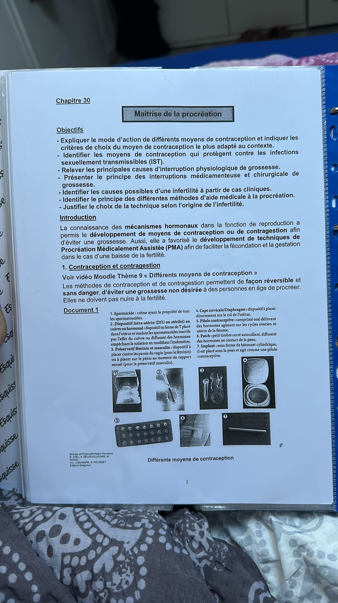
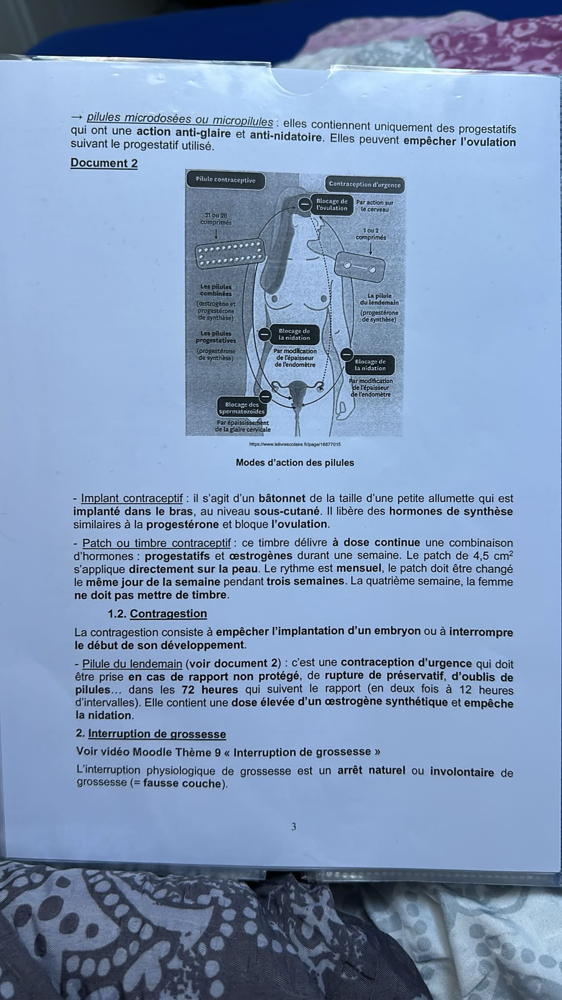
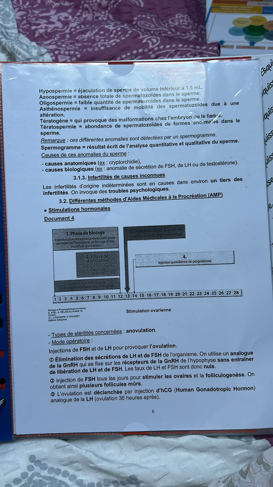
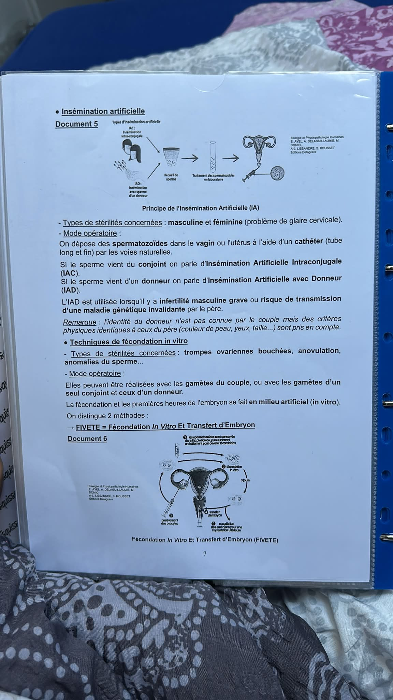
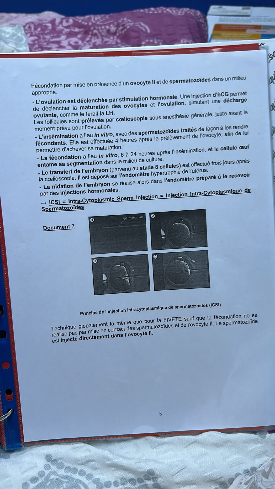

# Chapitre 30 — Maîtrise de la procréation

## Les notions importantes

---

## 1. Introduction

La connaissance des **mécanismes hormonaux** dans la fonction de reproduction a permis le développement de **moyens de contraception ou de contragestion** afin d'éviter une grossesse. Elle a également favorisé le développement de techniques de **Procréation Médicalement Assistée (PMA)** afin de faciliter la fécondation et la gestation dans le cas d'une baisse de la fertilité.

**Étymologies :**
- **A/An** = absence
- **Mén(o)** = mois
- **-rrhée** = écoulement
- **Aménorrhée** = absence de règles ou de menstruations

---

## 2. Contraception et contragestion

Les méthodes de contraception et de contragestion permettent, de façon **réversible** et **sans danger**, d'éviter une grossesse non désirée à des personnes en âge de procréer. Elles **ne doivent pas nuire à la fertilité**.

> 📷 *Schéma du prof — Différents moyens de contraception*
>
> 

### 2.1 Contraception

La contraception agit **avant la fécondation** en **empêchant la rencontre des gamètes**.

Les méthodes contraceptives sont **mécaniques** ou **chimiques**.

#### Méthodes mécaniques

**Préservatif masculin :**
- Gaine de latex très fine qui, placée sur le pénis en érection, retient les spermatozoïdes lors de l'éjaculation.
- Méthode très efficace si utilisée correctement.
- ⚠️ **Protège contre les IST** (Infections Sexuellement Transmissibles) → seul moyen de contraception à le faire.

**Préservatif féminin :**
- Préservatif en polyuréthane placé dans la cavité vaginale.
- Recouvre également l'appareil génital externe féminin.
- Empêche le passage des spermatozoïdes dans le vagin.
- ⚠️ **Protège contre les IST**.

**Diaphragme ou cape cervicale :**
- Disque souple en fin latex ou en silicone à placer au fond du vagin sur le col de l'utérus.
- Maintenu en place par un anneau souple.
- Recouvre le col de l'utérus et **empêche le passage des spermatozoïdes**.
- ⚠️ Toujours associé à l'utilisation d'un **produit spermicide**.

**Stérilet ou Dispositif Intra-Utérin (DIU) :**
- Petit appareil en matière plastique (3 à 4 cm, 200 à 300 mg) autour duquel s'enroule une fine spirale de cuivre.
- Placé par le **médecin** dans la cavité utérine.
- Peut être laissé en place **2 à 4 ans**.
- Mode d'action :
  - Agit sur la **glaire cervicale** (la rend hostile aux spermatozoïdes)
  - Si fécondation → **empêche l'implantation de l'œuf** (réaction inflammatoire de la muqueuse utérine)
- ⚠️ **Déconseillé** aux femmes n'ayant pas encore eu d'enfants (risques de stérilité).
- Méthode de contraception très efficace.

#### Méthodes chimiques

**Spermicides :**
- Se présentent sous forme de crèmes, gelées, sprays, mousses ou ovules.
- Introduits dans le vagin **avant chaque rapport sexuel** ou associés à d'autres moyens de contraception.
- Ont le pouvoir d'**immobiliser ou de tuer les spermatozoïdes**.
- ⚠️ **Efficacité limitée seuls** — toujours recommandés en association avec une autre méthode (diaphragme, préservatif).

**Pilules contraceptives :**
Les pilules bloquent l'ovulation et/ou modifient l'endomètre et la glaire cervicale pour empêcher le passage des spermatozoïdes.

Il en existe plusieurs types :

→ **Pilules combinées** (à base d'œstrogènes et de progestatifs) :
- Ces deux hormones exercent un **rétrocontrôle négatif** sur l'adénohypophyse → réduction de la sécrétion de **FSH et de LH** → **l'ovulation n'a pas lieu** (absence de pic de LH).
- Les progestatifs ont une **action anti-glaire** (la glaire cervicale s'épaissit) et une **action anti-nidatoire** (empêchent le développement de l'endomètre).
- En prise 21 ou 28 jours selon les marques.

→ **Pilules séquentielles** :
- Contiennent des œstrogènes seuls les premiers jours puis des œstrogènes + progestatifs.
- **Bloquent l'ovulation** et ont une **action anti-glaire** et **anti-nidatoire**.

→ **Pilules microdosées ou micropilules** :

> 📷 *Schéma du prof — Modes d'action des pilules contraceptives et contraception d'urgence*
>
> 

- Contiennent **uniquement des progestatifs**.
- Action **anti-glaire** et **anti-nidatoire**.
- Peuvent **empêcher l'ovulation** suivant le progestatif utilisé.

**Implant contraceptif :**
- Bâtonnet de la taille d'une petite allumette **implanté dans le bras**, au niveau **sous-cutané**.
- Libère des hormones de synthèse similaires à la **progestérone**.
- **Bloque l'ovulation**.

**Patch ou timbre contraceptif :**
- Timbre carré autocollant de 4,5 cm² s'appliquant **directement sur la peau**.
- Délivre à **dose continue** une combinaison d'hormones : **progestatifs et œstrogènes**.
- Le rythme est **mensuel** : le patch doit être changé **le même jour de la semaine** pendant **3 semaines**. La **4ème semaine**, la femme **ne doit pas mettre de timbre**.

### 2.2 Contragestion

La contragestion consiste à **empêcher l'implantation d'un embryon** ou à **interrompre le début de son développement**.

**Pilule du lendemain :**
- C'est une **contraception d'urgence**.
- Doit être prise en cas de **rapport non protégé**, de **rupture de préservatif** ou d'**oubli de pilules**, dans les **72 heures** qui suivent le rapport (en deux fois à 12 heures d'intervalles).
- Contient une **dose élevée d'un œstrogène synthétique**.
- **Empêche la nidation**.

---

## 3. Interruption de grossesse

### 3.1 Interruption physiologique (= fausse couche)

L'interruption physiologique de grossesse est un **arrêt naturel ou involontaire de grossesse**.

**Principales causes :**

| Causes liées à l'embryon ou au fœtus | Causes liées à la mère |
|---|---|
| Maladies génétiques et chromosomiques (nombre ou structure des chromosomes) | Anomalies congénitales utérines, fibromes dans l'utérus, anomalies d'insertion du placenta, béance cervico-isthmique |
| Malformations cardiaques ou nerveuses d'origine génétique, infectieuse ou tératogénique | Intolérance immunitaire (rejet de l'embryon comme un corps étranger) |
| | Diabète gestationnel, infections virales (grippe, herpès, rubéole...), infections parasitaires (toxoplasmose) |

**Térat(o)** = monstre → **Tératogène** = qui provoque des malformations chez l'embryon ou le fœtus.

### 3.2 Interruption Volontaire de Grossesse (IVG)

En France, la loi sur l'**IVG** permet à **toute femme enceinte** (majeure ou mineure) qui s'estime dans une **situation de détresse** (grossesse non désirée) d'avoir recours à une interruption de grossesse. Il s'agit d'une **interruption provoquée**.

Le **délai légal d'avortement** est fixé en France à la fin de la **12ème semaine de grossesse** (14 semaines d'aménorrhée).

**Interruption Médicale de Grossesse (IMG) :**
Si l'IVG est provoquée pour des raisons médicales, il s'agit d'une **IMG**, qui peut être pratiquée **jusqu'à la fin de la grossesse**. Elle est proposée quand l'embryon présente une **affection grave et incurable** ou que la poursuite de la grossesse présente un **risque pour la santé de la mère**.

### 3.3 Deux techniques d'interruption de grossesse

L'interruption de grossesse fait appel à deux techniques. La méthode utilisée dépend de la **durée de la grossesse**.

#### 2.2.1 Interruption médicamenteuse

- Réalisée dans un **établissement de santé** ou dans le **cabinet d'un médecin de ville**.
- Repose sur la prise de **deux médicaments** en deux étapes :
  1. Prise d'un **antiprogestatif** (type **RU486**) qui interrompt la grossesse en **bloquant l'action de la progestérone** et en rendant la muqueuse impropre au maintien de la grossesse.
  2. **Après 48 heures**, prise de **prostaglandines** qui induisent des **contractions** et l'**ouverture du col**, provoquant une **hémorragie avec expulsion complète du fœtus par voie naturelle**.
- Peut être pratiquée pour les grossesses inférieures à la **7ème semaine d'aménorrhée** (= 5ème semaine de grossesse).

#### 2.2.2 Interruption chirurgicale

- **Obligatoirement réalisée en établissement de santé**.
- Consiste en une **aspiration de l'œuf**, précédée d'une **dilatation du col de l'utérus**.
- Réalisée sous **anesthésie locale ou générale**.
- Peut être pratiquée pour les grossesses inférieures à la **14ème semaine d'aménorrhée** (= 12ème semaine de grossesse).

---

## 4. Infertilité et Aide Médicale à la Procréation (AMP)

**Infertilité** = incapacité à procréer.

⚠️ On parle d'infertilité lorsqu'un couple ayant un désir d'enfant et des rapports sexuels réguliers sans contraception depuis **au moins un ou deux ans** ne parvient pas à concevoir un enfant.

### 4.1 Origines de l'infertilité

Les infertilités se répartissent en **trois tiers** approximatifs :
- **1/3** d'infertilités **féminines**
- **1/3** d'infertilités **masculines**
- **1/3** d'infertilités de **causes inconnues** (troubles psychologiques invoqués)

#### 4.1.1 Infertilités féminines

**Causes mécaniques :**
- La rencontre entre les gamètes n'est pas possible (exemple : **glaire cervicale anormale**).
- La fécondation a lieu mais l'implantation ou la grossesse ne peut pas se réaliser (exemple : **malformation de l'utérus**).
- Diagnostic par **hystérosalpingographie** (= radiographie de l'utérus et des trompes utérines après injection d'un produit de contraste opaque aux rayons X) ou **échographie**.

**Causes infectieuses :**
- Des infections de l'appareil génital (exemples : **mycose**, **cervicite**, **endométrite**) passant inaperçues ou mal soignées peuvent conduire à des **salpingites** → **obstruction des trompes utérines** liée à la réaction inflammatoire.

**Définitions utiles :**
- **Mycose** = infection due à un champignon inférieur
- **Cervicite** = inflammation du col de l'utérus
- **Endométrite** = inflammation de la muqueuse de l'utérus
- **Salpingite** = inflammation d'une trompe utérine
- **Gynéc(o)** = femme → **Gynécologie** = étude des maladies de l'appareil génital féminin et de leur traitement

**Causes hormonales :**
- Dérèglements hormonaux conduisant à une **anovulation** (exemple : synthèse insuffisante de LH).

#### 4.1.2 Infertilités masculines

**Causes mécaniques :**
- Le sperme ne peut pas être déposé au fond du vagin lors de l'acte sexuel (exemples : **impuissance**, problème d'**érection**, **éjaculation précoce**...).

**Anomalies du sperme** (détectées par **spermogramme**) :

| Anomalie | Définition |
|---|---|
| **Hypospermie** | Éjaculation de sperme de volume inférieur à 1,5 mL |
| **Azoospermie** | Absence totale de spermatozoïdes dans le sperme |
| **Oligospermie** | Faible quantité de spermatozoïdes dans le sperme |
| **Asthénospermie** | Insuffisance de mobilité des spermatozoïdes due à une altération |
| **Tératospermie** | Abondance de spermatozoïdes de formes anormales dans le sperme |

**Spermogramme** = résultat écrit de l'analyse **quantitative et qualitative** du sperme.

**Causes des anomalies du sperme :**
- Causes **anatomiques** (ex : **cryptorchidie** = testicule(s) non descendu(s) dans les bourses)
- Causes **biologiques** (ex : anomalie de sécrétion de FSH, de LH ou de testostérone)

#### 4.1.3 Infertilités de causes inconnues
Représentent environ 1/3 des infertilités. On invoque des **troubles psychologiques**.

### 4.2 Différentes méthodes d'Aide Médicale à la Procréation (AMP)

#### Stimulations hormonales

- **Types de stérilités concernées :** anovulation.

**Mode opératoire :**
1. **Élimination des sécrétions de LH et de FSH** : injection d'un analogue de la GnRH qui se fixe sur les récepteurs de GnRH de l'hypophyse **sans entraîner de libération** de LH et de FSH → les taux de LH et FSH deviennent **nuls**.
2. **Injection de FSH** tous les jours pour **stimuler les ovaires** et la folliculogenèse → obtention de **plusieurs follicules mûrs**.
3. **Déclenchement de l'ovulation** par injection d'**hCG** (Human Gonadotropic Hormone = analogue de la LH) → ovulation **36 heures** après.

> 📷 *Schéma du prof — Stimulation ovarienne*
>
> 

#### Insémination artificielle

- **Types de stérilités concernées :** masculine (anomalies du sperme) et féminine (problème de glaire cervicale).

**Mode opératoire :**
- Dépôt de spermatozoïdes dans le vagin ou l'utérus à l'aide d'un **cathéter** (tube long et fin) par les voies naturelles.

| Type | Origine du sperme |
|---|---|
| **IAC** (Insémination Artificielle Intraconjugale) | Sperme du **conjoint** |
| **IAD** (Insémination Artificielle avec Donneur) | Sperme d'un **donneur** |

L'**IAD** est utilisée lorsqu'il y a une **infertilité masculine grave** ou un **risque de transmission d'une maladie génétique invalidante** par le père.

⚠️ L'identité du donneur n'est pas connue par le couple, mais des critères physiques identiques à ceux du père (couleur de peau, yeux, taille...) sont pris en compte.

#### Techniques de fécondation in vitro

- **Types de stérilités concernées :** trompes ovariennes bouchées, anovulation, anomalies du sperme.

##### FIVETE = Fécondation In Vitro Et Transfert d'Embryon

La fécondation et les premières heures de développement de l'embryon se font **en milieu artificiel (in vitro)**.

**Mode opératoire :**
1. Les spermatozoïdes sont conservés dans l'azote liquide, puis subissent un **traitement pour devenir fécondants**.
2. **Stimulation ovarienne** (injection d'hCG) → **prélèvement des ovocytes** par cœlioscopie sous anesthésie générale, juste avant le moment prévu pour l'ovulation.
3. **Insémination in vitro** : mise en présence de l'ovocyte II et des spermatozoïdes traités en milieu approprié, **4 à 24 heures** après le prélèvement de l'ovocyte.
4. **Fécondation in vitro** → la cellule œuf entame sa **segmentation** dans le milieu de culture.
5. **Transfert de l'embryon** (parvenu au stade **8 cellules**, 3 jours après la cœlioscopie) dans l'**endomètre hypertrophié** de l'utérus.
6. **Nidation** de l'embryon dans l'**endomètre préparé** par des **injections hormonales**.
7. Les embryons non transférés peuvent être **congelés** pour une **implantation ultérieure**.

> 📷 *Schéma du prof — Principe de la FIVETE (Fécondation In Vitro Et Transfert d'Embryon)*
>
> 

##### ICSI = Intra-Cytoplasmic Sperm Injection (= Injection Intra-Cytoplasmique de Spermatozoïdes)

- Technique globalement **identique à la FIVETE**, sauf que la fécondation **ne se réalise pas** par mise en contact des spermatozoïdes et de l'ovocyte II.
- Le spermatozoïde est **injecté directement dans l'ovocyte II**.

> 📷 *Schéma du prof — Principe de l'ICSI (Injection Intra-Cytoplasmique de Spermatozoïdes)*
>
> 

- Utilisée en cas d'**infertilité masculine grave** (quantité insuffisante de spermatozoïdes ou spermatozoïdes non mobiles).

---

## 5. Tableau récapitulatif des méthodes contraceptives ⚠️

| Méthode | Type | Mode d'action | Protège IST | Points clés |
|---|---|---|---|---|
| **Préservatif masculin** | Mécanique | Retient les spermatozoïdes | ✅ OUI | Très efficace si bien utilisé |
| **Préservatif féminin** | Mécanique | Empêche les spermatozoïdes d'entrer | ✅ OUI | Polyuréthane |
| **Diaphragme / cape cervicale** | Mécanique | Obture le col de l'utérus | ❌ NON | Toujours + spermicide |
| **Stérilet / DIU** | Mécanique + chimique | Anti-glaire + anti-nidatoire | ❌ NON | 2-4 ans ; médecin ; déconseillé avant 1er enfant |
| **Spermicide** | Chimique | Tue / immobilise les spermatozoïdes | ❌ NON | Souvent associé à d'autres méthodes |
| **Pilule combinée** | Chimique | Rétrocontrôle négatif → pas de pic LH → pas d'ovulation + anti-glaire + anti-nidatoire | ❌ NON | Œstrogènes + progestatifs |
| **Pilule séquentielle** | Chimique | Bloque l'ovulation + anti-glaire + anti-nidatoire | ❌ NON | Œstrogènes puis œstro + progest. |
| **Micropilule** | Chimique | Anti-glaire + anti-nidatoire (± bloque ovulation) | ❌ NON | Uniquement progestatifs |
| **Implant** | Chimique | Bloque l'ovulation | ❌ NON | Bâtonnet sous-cutané dans le bras |
| **Patch** | Chimique | Bloque l'ovulation + anti-glaire | ❌ NON | Timbre 4,5 cm², mensuel, 3 semaines sur 4 |
| **Pilule du lendemain** | **Contragestion** | Empêche la nidation | ❌ NON | Urgence, dans les 72h ; dose élevée d'œstrogène synthétique |

⚠️ **À retenir absolument :** le préservatif est le **seul moyen** qui protège contre les IST.

---

## 6. Tableau récapitulatif des méthodes d'AMP

| Méthode | Indication | Principe |
|---|---|---|
| **Stimulation hormonale** | Anovulation | Analogue GnRH → bloc → FSH → follicules mûrs → hCG → ovulation |
| **IAC** | Anomalies du sperme / glaire cervicale | Sperme du conjoint déposé dans l'utérus par cathéter |
| **IAD** | Infertilité masculine grave / maladie génétique | Sperme d'un donneur anonyme |
| **FIVETE** | Trompes bouchées, anovulation, anomalies sperme | Fécondation in vitro → transfert embryon (stade 8 cellules) |
| **ICSI** | Infertilité masculine grave | Spermatozoïde injecté directement dans l'ovocyte II |

---

## 🔁 Récap express — Chapitre 30

- Contraception = empêche la rencontre des gamètes (avant la fécondation)
- Contragestion = empêche l'implantation de l'embryon
- Seul le préservatif (masculin ou féminin) protège contre les IST
- Pilule combinée → rétrocontrôle négatif sur adénohypophyse → pas de pic de LH → pas d'ovulation
- Pilule du lendemain = contraception d'urgence, dans les 72h, empêche la nidation
- Fausse couche = interruption physiologique (naturelle)
- IVG : jusqu'à 12ème semaine de grossesse ; médicamenteuse (jusqu'à 7 SA) ou chirurgicale (jusqu'à 14 SA)
- IMG = IVG pour raisons médicales (maladie grave et incurable du fœtus ou risque pour la mère)
- Infertilité = incapacité à procréer (1/3 féminine, 1/3 masculine, 1/3 inconnue)
- Spermogramme → anomalies du sperme : hypospermie, azoospermie, oligospermie, asthénospermie, tératospermie
- AMP : stimulation hormonale (anovulation) → insémination artificielle (IAC/IAD) → FIVETE → ICSI
- FIVETE = fécondation in vitro + transfert embryon au stade 8 cellules
- ICSI = spermatozoïde injecté directement dans l'ovocyte II
